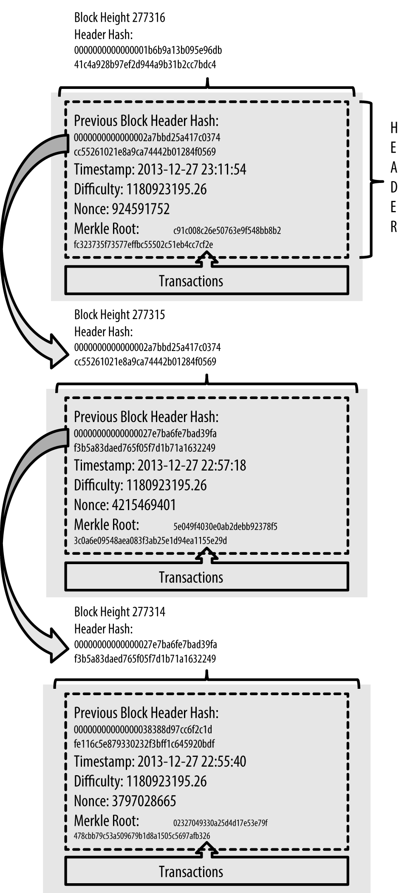
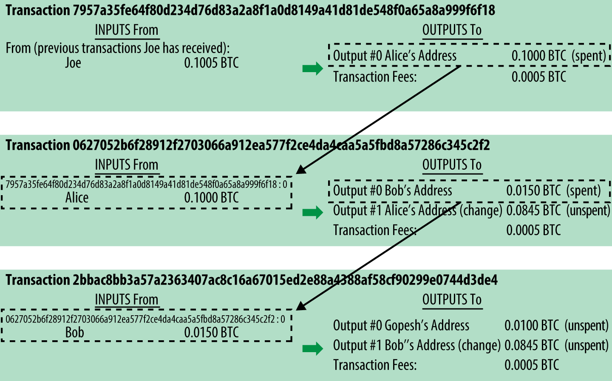

# Introducción a Blockchain y criptomonedas

El siguiente documento presenta una introducción a las tecnologías denominadas *"blockchain"* y criptomonedas junto con sus principales referentes y la aplicación de dichas tecnologías en el ámbito corporativo.

## ¿Qué es blockchain?

Antes de definir qué es blockchain, me gustaría aclarar qué no lo es. Uno de los errores más comunes es pensar que Bitcoin (un protocolo y criptomoneda) es lo mismo que hablar de blockchain, pero en realidad, blockchain es la tecnología que usa Bitcoin, podríamos decir que son los cimientos en donde Bitcoin se apoya. Más adelante explicaremos qué es Bitcoin, pero primero desterremos este primer mito.

Pero entonces, ¿Qué es blockchain?. Blockchain, como hemos dicho, es una tecnología, y su palabra literalmente traducida al español significa "cadena de bloques". Su nombre es incluso una posible descripción sobre cómo se organiza la información que se guarda en estos bloques.

La mayoría de los sistemas informáticos actuales guardan en sus bases de datos una tabla de usuarios, la cual mantiene un registro de todos los usuarios que pueden usar un sistema. Cada fila en la tabla de usuarios representa un usuario particular del sistema y cada columna representa algún dato o atributo sobre dicho usuario. Usualmente por cada usuario se suele mantener registro sobre su nombre, apellido, dirección de email, fecha de nacimiento, etc.

| Nombre   | Apellido     | Email                          | Fecha de nacimiento |
| -------- | ------------ | ------------------------------ | ------------------- |
| Guido    | Marucci Blas | guidomb@wolox.com.ar           | 1988-11-29          |
| Anita    | Romero       | anita.romero@wolox.com.ar      | 1989-05-03          |
| Luciano  | Zemin        | zeminlu@wolox.com.ar           | 1988-09-07          |
| Santiago | Bermudez     | santiago.bermudez@wolox.com.ar | 1988-08-08          |

Así como las tablas en una base de datos tradicional son una forma de agrupar ciertas datos que comparten un conjunto de atributos. **Podemos pensar, de forma similar, que los bloques son también una forma de agrupar datos en una base datos**. Estos bloques, en general, tienen un tamaño máximo definido y su estructura es menos flexible. Es decir la forma en la que se deben guardar los datos ya está predefinida por el sistema. 

Los bloques tiene dos *"partes"*. Una primer parte denominada *header* o encabezado y una segunda parte denominada *body* o cuerpo. En el *header* se encuentra meta-información que describe el contenido del bloque y en el *body* se encuentras los datos a almacenar.

Cada bloque puede ser identificado de forma unívoca mediante un identificador denominada *blockhash*. Así como los usuarios en un sistema informático están identificados por el número o nombre de usuario (el cual debe ser único), los bloques también tienen un identificador. Estos identificadores son un conjunto de número y letras de la forma `00000000000000000033ad6e4511735c9c883df1cede97634dda2cb4436bb869`.

### Blockhash: ¿Qué es y cómo se genera? 

Los blockhash o identificadores de bloques se generan mediante una función matemática denominada [hash](https://en.wikipedia.org/wiki/Cryptographic_hash_function). Esta función recibe un dato como entrada y devuelve un valor de longitud fija (también denominado hash o digest).

#### Funciones de hash 

Las  funciones de hash también garantizan que el valor devuelto es único estableciendo una relación entre el dato de entrada y la salida. 

Otra característica de dicha función es que es imposible invertir el proceso, es decir no es posible obtener el dato de entrada si solo conocemos el dato de salida. La única forma es probando datos de entrada hasta obtener un dato de salida que sea igual al dato de salida que ya conocíamos. Dependiendo de la función de hash que se use, el proceso de probar datos de entrada de forma aleatoria hasta obtener un hash conocido puede tardar cientos o miles de años. Por último cualquier cambio, por más mínimo que sea, en el dato de entrada genera un dato de salida totalmente distinto. Lo cual hace imposible "adivinar" datos de salida usando datos de entrada similares.

En ciencias de la computación o ingeniería de software las funciones de hash son muy usadas. Una de las aplicaciones mas importantes se da a la hora de verificar que un documento no ha sido alterado. Por ejemplo supongamos que estamos trabajando en un contrato, que tiene cientos de páginas, el cual describe la relación comercial entre dos empresas. Una posible forma de garantizar que dicho documento no fue modificado (por un posible usuario malicioso) podría ser mediante el uso de una función de *hash*. Ya que podemos calcular el *hash* o *digest* usando el documento entero como entrada de la función de *hash*. Luego si nosotros conocíamos de ante mano el *hash* del documento original, solo necesitamos verificar que ambos *hashes* son iguales. 

Otra de las aplicaciones más comunes de las funciones de *hash* es verificar que un archivo no este corrupto. Cuando descargamos un archivo muy pesado de internet, podría llegar a ocurrir que se pierda o altere un byte de dicho archivo debido a un error de transmisión. Muchos sitios que permiten descargar archivos también muestran el *hash* o *digest* de dicho archivo, para que luego el usuario pueda calcular el *hash* o *digest* del archivo que descargo y compararlo con el publicado por el sitio. De esta forma nos aseguramos que la descarga fue realizada con éxito y el archivo no fue corrompido. Este tipo de verificaciones es particularmente importante cuando descargamos un archivo de un sitio del cual no confiamos. Si logramos obtener un *hash* o *digest* del archivo que queremos descargar de una fuente segura de la cual confiamos, luego podemos obtener dicho archivo de cualquier otro lado (e.j: Bittorrent). Una vez obtenido el archivo, debemos calcular su *digest* (usando una función de *hash*)  y compararlo con el *digest* que habíamos obtenido de la fuente segura para asegurarnos que ningún usuario malicioso modifico dicho archivo.

#### Blockhash

En el caso de los *blockhash* o identificadores de bloques estos se calculan mediante el uso de una función de *hash* usando como dato de entrada el *header* del bloque. A su vez dentro de la información que se guarda en el *header* del bloque hay un *hash* que se calcula sobre el conjunto de datos que se encuentra en el *body* del bloque. De esta forma se puede asegurar la integridad de los datos que un *blockhash* referencia ya que si se hace un pequeño cambio en los datos almacenados en el *body* del bloque, el hash que se almacena en el header cambiaría; y esto a su vez haría que cambie el hash del *header* del bloque. De la misma forma si cambiamos cualquier otro dato que se almacena en el *header* el *blockhash* resultante cambiaría.

### Blockchain

Ahora que sabemos que son los *blockhash* y como se generan podemos explicar de donde viene el nombre *blockchain*. Como ya habíamos mencionado, *blockchain* significa cadena de bloques en inglés. Esto se debe a que cada bloque hace referencia a su bloque *"padre"*, formando efectivamente una cadena de bloques que uno puede seguir a través de dichas referencias. Cada bloque guarda en su *header* el *blockhash* del bloque padre.

### Descentralización y confianza como un servicio

La posibilidad de *"encadenar"* bloques garantizando la integridad de los datos que este almacena es la razón por la cual ésta tecnología es tan relevante. Dicha tecnología surge como respuesta al problema de la descentralización de datos, evitando que haya un intermediario que provea confianza para mantener la integridad de los mismos. También conocido como [el problema de los generales bizantinos](https://es.wikipedia.org/wiki/Problema_de_los_generales_bizantinos).

Para entender el problema de la descentralización de datos y a que nos referimos con *"confianza como un servicio"* es importante entender las motivaciones que llevaron a la creación de *blockchain* y *Bitcoin*.

Por ejemplo, cada vez que realizamos una transacción con nuestra tarjeta de débito o hacemos una transferencia a cambio de un bien o un servicio, ambas partes  involucradas en la transacción confiamos en que el banco efectivamente va a ejecutar la transacción. Es decir, si yo voy a comprar un café en la cafetería de moda, cuando pago dicho café con mi tarjeta de débito el dueño del local confía en que los fondos eventualmente serán depositados en su cuenta bancaria. Cuando hago una compra por MercadoLibre y uso MercadoPago, estoy confiando en estos servicios para que hagan de intermediario y en caso de que algo salga mal me devuelvan el dinero. También confío en los bancos, quienes me garantizan que los dígitos que muestran el saldo de mi caja de ahorro están respaldados en efectivo que puedo ir a retirar en cualquier momento. Muchas veces el precio que pagamos por esta confianza es explícito, otra veces no tanto.

En otros casos es un poco más complejo, como cuando queremos realizar un pago mediante una transferencia bancaria o una cuenta en el exterior. Muchas veces este tipo de transacciones incurren en altos costos, tanto para mover el dinero de una cuenta a la otra, así como también los costos que pagamos por posibles cambios de monedas. Ni hablar de las demoras que muchas veces tienen dichas transferencias, que pueden variar desde tres a varios días hábiles.

#### Ledger

Históricamente las entidades financieras mantienen un libro mayor o *"ledger"* (en inglés) que se encarga de registrar las transacciones entre distintos usuarios. De esta forma es relativamente sencillo ver cual es el saldo que tiene un usuario y en caso de haber alguna disputa uno puede revisar las transacciones registradas en el *ledger* y ver cuál fue el flujo del dinero.

Los bancos modernos mantienen un "ledger" digital en sus base de datos en sistemas informáticos. Cuando los bancos tienen que ejecutar transacciones con otros bancos (porque un usuario transfiere dinero a la cuenta de otro usuario de otro banco), estos registran dichas transacciones en sus respectivas bases de datos o "ledgers" de forma independiente. 

Durante un período de tiempo las transacciones entre ambos bancos se van acumulando y al final de dicho período (puede ser un día, semana o mes) cada banco se fija cuanto dinero entró y cuanto salió contra cada otro banco y solo abonan la diferencia en efectivo (esto es una simplificación del proceso real). Este proceso es denominado proceso de conciliación bancaria. 

Como cada banco mantiene un registro independiente de las transacciones ambos deben ponerse de acuerdo sobre el saldo que un banco le debe a otro. Cuando estos no se ponen de acuerdo deben revisar ambas bases de datos y tratar de encontrar donde esta la discrepancia.

Por ende cada vez que nosotros ejecutamos una transferencia bancaria, estamos confiando en que el banco va a registrar dicha transferencia y va a depositar dicho saldo en la cuenta destino, tomando todas las medidas necesarias para asegurarse que dicha transacción se va a ejecutar de forma satisfactoria. 

> Seguramente les habrá pasado o habrán escuchado algún problema a la hora de ejecutar transacciones donde el dinero es efectivamente descontando de su cuenta pero no fue acreditado en la cuenta destino.

#### Confianza

Todo el sistema financiero moderno se basa en la confianza. En la confianza que los usuarios depositan en los bancos asumiendo que estos tiene el respaldo suficiente en caso de que uno quiera retirar su dinero. En el caso de ser un comerciante, uno confía en los procesadores de tarjetas de créditos quienes deberían depositar todos los pagos ejecutados por nuestro clientes en un tiempo razonable.

Lamentablemente el sistema ha demostrado una y otra vez que esto no es el caso. Hay muchos ejemplos en la historia entre ellos el famoso corralito de 2001 en Argentina, el corralito en Grecia en 2015 o como PayPay, Visa y Mastercard congelaron los activos y dejaron de procesar donaciones a WikiLeaks en 2010.

## Bitcoin

Bitcoin plantea una solución al problema de la confianza en particular en el ámbito de las transacciones monetarias. Bitcoin fue publicado en 2009 por Satoshi Nakamoto, aunque no se conoce la real identidad del, las o los inventores ya que Satoshi es un pseudónimo. Ese año se publicó el [whitepaper](https://bitcoin.org/bitcoin.pdf) que describe como funciona la red de Bitcoin y una implementación de referencia conocida como [BitcoinCore](https://github.com/bitcoin/bitcoin).

Bitcoin se describe como una criptomoneda y un sistema de pagos mundial. Es la primer moneda 100% descentralizada sin ningún órgano central que la regule o emita más moneda. Es una red *peer-to-peer* donde las transacciones se hacen directamente entre usuarios sin ningún intermediario.

El registro de las transacciones se guarda en un *ledger* distribuido, donde cada nodo en la red mantiene una copia de todas las transacciones realizadas. Un nodo es simplemente una computadora que ejecuta el software de Bitcoin. Cualquiera puede conectarse a la red. Mientras más nodos haya mas fuerte se hace la red ya que hay más maquinas procesando las transacciones y hay más copias de la base de datos lo cual hace que la red se más robusta.

Bitcoin guarda las transacciones usando *blockchain*, donde cada bloque guarda un set de transacciones. Una transacción define de donde provienen los fondos (de que "cuenta") y a donde transferirlos. Al usar *blockchain* para guardar las transacciones, Bitcoin garantiza la inmutabilidad de los datos ya que como todos los nodos mantienen una copia del *ledger*; es fácil verificar si una transacción es válida.

> Bitcoin es el nombre del protocolo (o conjunto de tecnologías) y también es el nombre de la criptomoneda. Así como el dólar tiene su símbolo, USD en el caso de Bitcoin es BTC. Un Bitcoin puede dividirse en varias partes siendo su mínima unidad el Satoshi. Un Bitcoin es equivalente 100.000.000 de Satoshis.
>
> El termino criptomoneda se debe a que una parte importante de la tecnología, que es esencial para mantener la seguridad de la red, se basa en el uso de distintos algoritmo criptográficos que hacen posible la implementación de una moneda 100% distribuida sin un ente central que la regule.

### Centralizado v.s. distribuido

Es importante entender la diferencia entre un servicio distribuido y uno centralizado. Sistemas centrales de procesamiento de pagos como Visa exponen un único servicio, es decir los clientes que quieren ejecutar una transacción se conectan con un "único" servicio ofrecido por Visa. Si bien Visa internamente puede usar varios servidores para poder procesar el gran volumen de transacciones, para los clientes estos servidores se exponen como si fuera un único servidor, por ende hay una sola conexión entre el cliente servidor. En el caso de Bitcoin cada nodo debe conectarse con varios nodos de la red, por ende estableciendo varias conexiones. Cada nodo replica cada mensaje que le llega con sus nodos vecinos, de esta forma todos los nodos (eventualmente) se mantiene sincronizados.

### Transacciones

Para que el sistema funcione, los usuarios deben poder confiar que la red de Bitcoin efectivamente mantiene registros de todas las transacciones realizadas y que puede resistir ataques de usuarios maliciosos que podrían intentar alterar la base de datos en su beneficio (con el objetivo por ejemplo de agregar transacciones falsas que les adjudique bitcoins).

Para evitar estos problemas, todos los nodos mantienen un registro de todas las transacciones realizadas. Los nodos forman un red estableciendo conexiones con otros nodos. En promedio un nodo mantiene 100 conexiones con otros nodos (este valor varía de nodo en nodo ya que la máxima cantidad de conexiones es configurable por nodo). 

Cada vez que un usuario realiza una transacción (envía bitcoin de la cuenta de un usuario a otro usuario), el primer nodo que recibe la transacción, la valida y si la transacción es válida la propaga a sus vecinos (los nodos a los que esta conectado directamente). Cada nodo que recibe la transacción repite el proceso de validación y en caso de ser válida, también la propaga con sus vecinos y así sucesivamente.

En caso que una transacción no sea válida el nodo la descarta y no la propaga a sus vecinos. Esto tiene el efecto que si la mayoría de los nodos son honestos, la red solo procesa transacciones válidas y todos los nodos eventualmente tienen todas las transacciones. Luego veremos que incentivos tiene los nodos para ser honestos y por qué el sistema funciona. Cuando un nodo valida una transacción, ésta es guardada momentáneamente para luego ser incluida en un nuevo bloque de la blockchain.

En su forma más simple una transacción almacena información sobre el origen y el destino de los fondos, en este caso bitcoins. Las transacciones en bitcoin tiene distintos atributos, siendo los más importantes el *input* y *output* (o entrada y salida en inglés). El *input* refiere al origen de los fondos, y tiene la particularidad de ser una referencia al *output* de una transacción anterior. Esto quiere decir que las transacciones se referencian o enlazan entre si. Por ahora y a fines prácticos diremos que el *output* de una transacción es la dirección a donde se deben enviar los bitcoins. Similar al concepto de CBU o alias de una cuenta bancaria.

 

Supongamos que Bob quiere pagarle a Alice un café usando Bitcoin. Bob debe conocer la *"dirección"* de Alice para poder enviar los bitcoins. Supongamos que por el café debe abonar 5 bitcoins. Para que Bob pueda armar una transacción debe poder referenciar otras transacciones cuya salida haya sido su dirección, es decir que Bob sea dueño de esos bitcoins. Ahora supongamos que Bob solo usó Bitcoin dos veces, producto de dos regalos que recibió de sus amigos fanáticos de Bitcoin. Cada uno de estos amigos le regalo 3 bitcoins a Bob. Por ende en la blockchain hay 2 transacciones que tienen como salida la dirección de Bob y como valor tienen 3 bitcoins.

Como las transacciones solo pueden referenciar otras transacciones y solo pueden usar los fondos disponibles en las transacciones referenciadas, Bob necesita referenciar ambas transacciones para poder pagarle 5 bitcoins a Alice. Ya que ambas transacciones que le hicieron a Bob suman 6 bitcoins pero por separas no llegan a 5 bitcoins. La pregunta entonces es ¿Cómo hacemos para pagar 5 bitcoins cuando tenemos 6?. La respuesta es simple, la transacción que tiene que hacer Bob va a referenciar a las 2 transacciones que le hicieron sus amigos y como salida va a poner una entrada indicando que 5 bitcoins de los 6 disponibles van a la dirección de Alice y el bitcoin restante va para su dirección. Es decir Bob se transfiere a si mismo el *"cambio"* restante de la operación.

Generalmente sirve pensar estos escenarios como si uno tuviera que pagar algo que sale \$26 pero tiene un billete de \$10 y otro de \$20. Uno abona \$30 y a cambio recibe el objeto o servicio que desea consumir y dos billetes de \$2.

Uno puede combinar tantos inputs como quiera para poder abonar el monto deseado así como también puede dividir el total disponible en distintos *outputs*. Tampoco es necesario que una transacción solo tenga como destinatario una sola dirección, cada output puede referenciar a una dirección distinta o inclusive en casos más complejos a varias direcciones.

Algo importante que se desprende de este proceso es que una transacción solo puede referenciar como *input* el *output* de otras transacciones que no han sido consumidos. Ya que en el momento que una transacción referencia a un *output* en su *input*, esos bitcoins se consideran usados.

Los *outputs* que no fueron usados en ninguna transacción, bitcoins que uno puede gastar, se los conoce como UTXO o *unspent transaction output*. Cada vez que un nodo recibe una transacción debe validar, entre varias cosas, que los *inputs* referenciados en la transacción son UTXO. Como cada nodo tiene una copia de todos las transacciones que se hicieron en el sistema, es cuestión de revisar si efectivamente no hay ninguna otra transacción que referencie a estos UTXO como inputs de la misma.

Otra diferencia que tiene Bitcoin con un sistema bancario tradicional es que un usuario no guarda bitcoins en su dirección o billetera, en realidad lo que un usuario guarda es una *"llave"* que le permite *"abrir"* o usar los UTXO que tienen como destino su dirección. Esta *"llave"* usa un esquema criptográfico comúnmente conocido como *asymmentric cryptography* (criptografía asimétrica). Esta fuera del alcance de este documento explicar como funcionan las claves asimétricas pero a fines prácticos podemos pensarlo como una contraseña que prueba que un usuario es dueño de un UTXO y por ende puede usarlo.

Es importante remarcar que las transacciones en bitcoin son irreversible. A diferencia de una transacción con tarjetas de crédito donde uno puede desconocer un cargo, en el caso de bitcoin una vez que uno hizo una transacción no hay forma de revertirla. Si uno hace una transferencia por error, deberá contactar al usuario al que le hizo la transferencia y pedirle que le devuelva los bitcoins haciendo una nueva transacción y apostando a la buena voluntad de dicho usuario. Contactar al usuario podría llegar a ser imposible ya que no hay ninguna relación entre la identidad de un usuario y una dirección. Las transacciones en bitcoin no requieren una *"cuenta de usuario"* en el sentido tradicional, son solo un identificador de la dirección a donde se deben enviar los bitcoins. Quien tenga la *"llave"* para usar esa dirección es el *"dueño"* de esos bitcoins.

### Transaction fees

Si bien las transacciones en la red de Bitcoin son descentralizadas y si bien no hay un dueño de la red de Bitcoin las transacciones tienen un costo. Este costo es parte de la recompensa que se llevan ciertos nodos que tienen un rol especial, también conocidos como *miners*, por proveer un servicio a la red que es esencial para su funcionamiento. Ya entraremos en más detalle sobre el servicio que estos *miners* brindan pero por ahora es importante entender que hay un costo asociado al realizar una transacción en la red de Bitcoin. 

Cuando un usuario crea una transacción debe incluir el *transaction fee* el cual no aparece de forma explícita. El *transaction fee* se calcula como la diferencia entre todos los *inputs* y todos los *outputs*. Es decir que en el ejemplo anterior donde Bob quería pagarle un café a Alice, el cual costaba 5 bitcoins, si Bob usaba en sus *inputs* 2 UTXO que sumaban 6 bitcoins y dos outputs uno con la dirección de Alice con 5 bitcoins y otro con 0.5 bitcoins con su dirección; el *transaction fee* es de 0.5 bitcoins $(6 - (5 + 0.5))$. 

El transaction fee puede ser 0 pero éste es usado por los nodos de la red para priorizar el orden de las transacciones para ser incluida en un bloque. Transacciones con *fees* más grande tiene más prioridad. El precio mínimo de una transacción esta relacionado con el tamaño de la transacción en bytes. Transacciones más grandes son más caras. Sobre ese precio base se suma el incentivo que se quiere agregar para que los nodos de la red le den más prioridad a la transacción, con el objetivo que ésta tenga más chance de ser incluida en el próximo bloque. Recuerden que el tamaño de los bloques es finito.

Actualmente el costo de realizar una transacción en bitcoin es lo suficientemente alto (alrededor de USD 10 al momento de escribir esta sección y ha llegado a picos de U$D 50 ) lo cual lo hace económicamente inviable para transacciones pequeñas.

### Wallets

El *software* que es el encargado de ejecutar las transacciones de un usuario y custodiar las "*contraseñas*" (o llaves privada) para poder transferir bitcoins (usar UTXO) se llama *wallet* (billetera en inglés). Las *wallets* son nodos de la red que se encargan de mantener registro de todos los UTXO cuyo destino es la dirección del usuario. De esta forma la *wallet* puede mostrar el saldo de un usuario sumando todo los montos de los UTXO del usuario. Una *wallet* puede tener varias direcciones asociadas. Es virtualmente infinita la cantidad de direcciones que puede crear un usuario.

Las direcciones de una *wallet* generalmente se muestran al usuario en forma de *QR codes* para que otro usuario la escaneé. Esto evita el potencial error de tipeo que puede haber ya que en su forma alfanumérica las wallets son similares a los blockhash.

Hay 3 tipos de *wallets*:

* Desktop wallet (full node)
* Mobile wallet (light node)
* Web wallet

Las *desktop wallet* son un programa que corre en una computadora de escritorio o una computadora portátil. Ofrecen una interfaz gráfica para poder verificar el saldo, crear y administrar direcciones, realizar y recibir transacciones. Para esto las wallets también son un *full node* o cliente de la red de Bitcoin. Es decir mantiene un copia de toda la blockchain, se encargan de verificar todas las transacciones que se propagan por la red y monitorean los *UTXO* que tienen como dirección destino alguna de las direcciones manejadas por la misma wallet. De esta forma puede mostrar el saldo disponible y combinar los distintos *UTXO* para armar *inputs* a la hora de construir nuevas transacciones. Otro rol importante de dichas *wallets* es guardar las *llaves privadas* de las direcciones que administra de forma segura para poder desbloquear los *UTXO* y efectivamente poder usar los bitcoins. La desventaja que tienen estas wallets es que al ser un *full node* que participan en la red, consumen varios recursos en espacio de disco para mantener toda la blockchain y ancho de banda al mantener varias conexiones activas con otros nodos y recibir y enviar todo el tráfico que circula por la red.

Las *mobile wallet* son un programa que puede correr en una computadora o un celular. También ofrecen los mismos servicios que una *desktop wallet* en materia de administración de direcciones, enviar y recibir transacciones pero no son un *full node*. Usan una técnica que se llama SPV ([simple payment verification](https://bitcoin.org/en/glossary/simplified-payment-verification)), donde solo guarda los blockhash en su base de datos en vez de guardar todos los bloques enteros y solo reciben las transacciones que tienen como origen o destino alguna de las direcciones manejadas por la *wallet*. Este tipo de nodos no pueden verificar si una transacción es válida, solo pueden verificar si una transacción fue efectivamente validada por otros nodos y si se encuentra en un bloque previamente aceptado por la red. La seguridad de este tipo de nodos depende del grado de diversidad de nodos a los que este conectado. Si un atacante logra controlar todos los nodos a los que está conectado una *wallet* que usa SPV, esta podría llegar a aceptar transacciones inválidas.

Las *web wallet* son meramente un interfaz de usuario que se conecta, en la mayoría de los casos, a un servidor central controlado por una organización. Dicho servidor central es quien esta conectado a uno o varios nodos de la red de Bitcoin. En este tipo de *wallets* las llaves privadas son administrada por el servidor central y las operaciones que hace la *wallet* las hace a través de dicho servidor. La relación entre la *wallet* y el servidor central es la típica relación entre un cliente / servidor en una aplicación mobile tradicional. Este tipo de *wallets* son las más sencilla de usar y la que menos recursos consumen pero al no custodiar las llaves privadas y no estar conectada directamente a la red Bitcoin pierden toda garantías que provee el modelo distribuido de Bitcoin. Ya que se confía ciegamente en el servidor central que hace de puente entre la *wallet* y la red de bitcoin.

> Como las llaves privadas las administra el servidor central, éste podría decidir transferir los bitcoins a otra dirección y nosotros perderíamos acceso a nuestro fondos. Esto ha pasada varias veces ya sea porque la organización era un fraude o porque fue hackeada y los hackers robaron los bitcoins de todos los usuarios que guardan sus bitcoins con estas organizaciones. Siendo el caso más famoso el hackeo de [Mt.Gox](https://en.wikipedia.org/wiki/Mt._Gox)

### El rol de los miners

Hasta este momento hemos repasado los conceptos principales sobre como funciona Bitcoin pero falta una pieza clave. Si entendieron todo hasta este momento, sabrán que Bitcoin es una red descentralizada donde cada nodo que participa en la red guarda una copia de la base de datos que almacena todas las transacciones, llamada *ledger* y que dicha base de datos esta compuesta por bloques que se van encadenando formando una *blockchain*.

Las preguntas que surge luego son: 

* ¿Cómo garantiza Bitcoin que todos los nodos efectivamente mantienen la misma base de datos de transacciones?
* ¿Cuál es el mecanismo por el cual todos los nodos ven las mismas transacciones ? 
* ¿Cómo hace la red para evitar que un nodo "deshonesto" no altere, borre o agregue transacciones en su beneficio?

Para contestar estas preguntas Bitcoin presenta el uso de un algoritmo de consenso denominado *Proof of Work*. Los nodos que forman parte de la red de Bitcoin pueden tener varios roles. Como mínimo un nodo verifica todas las transacciones y guarda una copia de toda la blockchain. Pero hay otros nodos, denominados *miners* que son los encargados de agrupar las transacciones en bloques y distribuir los bloques al resto de la red para que los otros nodos los verifiquen y actualicen su copia de la base de datos.

> *Miners* o mineros se llaman a los nodos que se encargan de "minar" o generar nuevos bitcoins como parte del proceso de agregar un nuevo bloque a la *blockchain*.

Los *miners* reciben nuevas transacciones y las van acumulando con el objetivo de armar un nuevo bloque. Cada vez que reciben una transacción verifican que ésta esté bien formada. Entre varias reglas, verifican que los *input* de la transacción solo referencien a bitcoins no usados o *UTXO*. Así como también que el usuario que quiere usar esos *UTXO* pruebe que es el dueño de los bitcoins mediante el uso de firmas criptográficas. Estas transacciones son priorizadas en base a sus transacción fee*, las cuales serán recompensadas al *miner* que logre armar el nuevo bloque de transacciones. Por ende las transacciones que tienen *fees* más altos tiene más chance de ser incluidas en un nuevo bloque ya que, en caso de lograr armar el nuevo bloque, el *miner* tendrá mayor recompensa.

Todos los *miners* de la red compiten al mismo tiempo para ver quien puede armar el siguiente bloque de transacciones para ser incluido en la blockchain. La competencia se trata en resolver un "problema matemático" que está relacionado con el *blockhash* del bloque a ser minado (por ende también referencia al bloque anterior). El primer *miner* que encuentra la solución es quien tiene el derecho de armar el siguiente bloque. El orden de las transacciones en un bloque en particular es establecido por el *miner* ganador, lo más probable que el orden este dado por las transacciones que paguen *fees* más caros y por el orden en el que le llegaron dichas transacciones al nodo.

Como recompensa por haber encontrado la solución al "problema matemático", el *miner* puede agregar una transacción especial en el bloque que le transfiere a su dirección todos los bitcoins recolectados en *fees* y también genera nuevos bitcoins. Estos nuevos bitcoins se fabrican de la nada y es el principal incentivo que tienen los *miners* para invertir recursos en la red. Esta transacción es especial porque no tiene *inputs* por ende no referencia a ningún *UTXO*.

La emisión de bitcoins está regulada por la misma red y va decreciendo en el tiempo, es decir cada vez se "minan" menos bitcoins hasta llegar al límite de 21.000.000 BTC. Una vez que se llegue a ese límite no se emitirán más bitcoins. Es por esto que se dice que bitcoin es una moneda deflacionaria. Aproximadamente cada 4 años la red reduce a la mitad la cantidad de bitcoins nuevos que se emiten cada vez que se genera un nuevo bloque, hasta eventualmente llegar a cero. En ese momento el único incentivo que van a tener los *miners* para seguir generando bloques son las *transaction fees*.

La dificultad del "problema matemático" que deben resolver los *miners* se ajusta dinámicamente según el poder de cómputo de la red para que un bloque nuevo se genere cada 10 minutos aproximadamente. 

### Garantías de seguridad del minado

Otra de las características importantes de éste proceso que da garantías de seguridad e incentiva a los *miners* a ser "honestos", es la inversión en recursos (hardware y electricidad) que estos deben hacer. El proceso de encontrar una solución consume mucho tiempo de procesamiento y electricidad, por ende si los miners alteran, borran o agregan transacciones en su beneficio; el resto de la red descubre la adulteración y desestima el bloque. De esta forma todo el tiempo de cómputo y la energía invertida en la generación del bloque se pierde.

> El sitio [bitcoinmining.com](https://www.bitcoinmining.com/) muestra un buen video que explica el proceso de minado a alto nivel.

Como son los *miners* los que aceptan transacciones y forman bloques (que luego son validados y aceptados por el resto de la red), mientras más miners haya en la red más fuerte y segura se hace. Siempre y cuando los *miners* sean controlados por diferentes personas o entidades. Es decir, si la mayoría del poder de minado esta controlado por pocas personas, la red corre el riego de ser vulnerable a una ataque conocido como "*51% attack*".

Esto se debe a que una persona (o un grupo de personas que se ponen de acuerdo) con mas del 51% del poder de cómputo de la red, puede decidir en la mayoría de los casos cuales son los bloques válidos. Ya que cada vez que se genera un nuevo bloque, éste se agrega a la *blockchain* referenciando al bloque anterior. Un nodo (que puede no ser un *miner*, una *wallet* por ejemplo) que recibe un bloque nuevo debe verificar que éste referencia a un bloque que ya fue aceptado en su *blockchain* local y debe también verificar que todas las transacciones en el nuevo bloque referencian *UTXO* que apuntan a transacciones que ya fueron aceptadas en bloques anteriores.

Un nodo malicioso podría generar un nuevo bloque que modifique una transacción en donde transfirió bitcoins desde una de sus direcciones a la dirección de otro usuario y hacer que dicha transacción no exista o transfiera bitcoins a otra dirección en su poder. Este problema se conoce por el nombre de *double spend* (doble gasto en inglés).  Un atacante que hace uso de este ataque podría "revertir" una transacción y recuperar bitcoins que usó para pagar algún bien o servicio que ya fue consumido y no puedo ser devuelto.

Para evitar el problema del *double spend*, todos los nodos verifican cada transacción en cada nuevo bloque generado para ver que estas solo referencian *UTXO*, es decir outputs de transacciones anteriores que todavía no fueron usados. Debido a que todos los bloques están encadenados y todas las transacciones referencian en sus *inputs* los *outputs* de otras transacciones, cualquier nodo puede verificar la cadena de referencias de cualquier transacción hasta llegar al bloque génesis (el primer bloque) y ver que no hubo *double spend*.

La única forma entonces que tiene un nodo malicioso de poder generar bloques con transacciones falsas es efectivamente alterar toda la blockchain, es decir toda la cadena de referencias, desde el punto en donde desea realizar un *double spend*. El problema es que para hacer esto, el nodo malicioso debería generar tantos bloques falsos como tan profundo quiera ir la cadena de referencias para referenciar el *UTXO* que ya fue usado. 

Para poner un ejemplo, supongamos que al día de la fecha el bloque más reciente aceptado por la red es el bloque número 1200. Un nodo malicioso empieza a fabricar el bloque 1201 que incluye una transacción que tiene un *double spend*. Dicha transacción referencia un *UTXO* que ya fue usado, donde el atacante había transferido 1.000 BTC a otro usuario. La transferencia original por 1.000BTC que hace el nodo malicioso a otro usuario se realizó en el bloque 1181, es decir 20 bloques atrás. 

Debido a que todos los bloques referencian al bloque anterior mediante el *blockchash* y como el *blockhash* se genera usando una función de *hash* que tiene como entrada el *header* y *body* del bloque, por ende cualquier cambio en el bloque genera un *hash* totalmente distinto. El nodo malicioso debe modificar los últimos 20 bloques para hacer que la cadena haga efectivamente referencia a su "versión" de la blockchain donde la transacción en el bloque 1181 nunca existió, permitiéndole re-usar el *UTXO* de dicha transacción.

Esto se traduce en tener que generar 20 nuevos bloques y distribuirlos a todas la red para que el resto de los nodos acepten esta "versión" de la blockchain como la "verdadera versión". Cada nuevo bloque que debe generarse tiene que resolver el "problema matemático" que en promedio un *miner* tarda 10 minutos en resolver. Ya que dicho "problema matemático" involucra el *hash* del *header* y el *body* del bloque, y como es necesario modificar bloques; sus respectivos *hashes* cambian lo cual lleva a encontrar una solución para cada bloque alterado. Es decir que el nodo malicioso debería resolver 21 nuevos problemas matemáticos en menos de 10 minutos, sino otros *miners* podrían ganarle en la competencia de resolución de problemas y generar un nuevo bloque haciendo la blockchain sea más larga (hay un bloque más) y que él ahora deba modificar 22 bloques.

Todo el esquema de seguridad de Bitcoin se basa en que el poder de cómputo y la electricidad necesaria para resolver N problemas matemáticos más rápido que el resto de la red puede "minar" un bloque es mucho más caro que el valor en bitcoin que puede robarse modificando esos N bloques. Inclusive N podría ser tan grande que en cuyo no habría poder de computo disponible para poder volver a minar tantos bloques. Por otro lado un robo masivo de fondos haría que la gente pierda confianza en el sistema haciendo que efectivamente todos los bitcoins dejen de tener valor. Por ende un atacante solo debería robar algunos bitcoins.

Es por esta razón que comúnmente se dice que luego de los 6 bloques confirmados, la blockchain es virtualmente inmutable, ya que deja de tener sentido económico la inversión necesaria para poder modificar más de 6 bloques. El tiempo de confirmación de 6 bloques es aproximadamente 1 horas (10 minutos por bloque). Por eso en caso de hacer transacciones de bienes o servicios por sumas "grandes" y porque las transacciones son irreversibles, se recomienda esperar una hora para estar seguro que la red "confirmó" la transacción.

Para transacciones de montos chicas (pagar un café por ejemplo), con esperar un solo bloque de confirmación alcanza, ya que el riesgo que alguien ataque la blockchain para revertir el costo de un café es casi nulo. Este riesgo es tan chico que los comercios están dispuesto a no esperar que un *miner* incluya la transacción en un nuevo bloque, solo le alcanza con ver que la transacción se propago a otros nodos. Es el mismo riesgo que los comercios están dispuestos a aceptar cuando no piden firmas de los recibos de tarjetas de crédito por montos bajo.

### Encontrando la solución al "problema matemático"

El "problema matemático" que deben resolver los *miners* se podría simplificar como adivinar un valor de entrada al cual al aplicarle una función de *hash* devuelve una salida esperada. Anteriormente se explicó que la red de bitcoin ajusta la dificultad del problema para que en promedio una solución, por ende un nuevo bloque, se mine cada 10 minutos en promedio. Para eso los *miners* deben encontrar un valor de entrada para la función de *hash* cuya salida empiece con cierto prefijo. Si recuerda las salida de una función de *hash* tiene un largo determinado, por ende mientras más largo o específico sea el prefijo más difícil se hace el problema porque hay menos caracteres o bits que están "libres". Es decir hay menos valores posibles de salida que comparten el mismo prefijo.

A fines prácticos imaginemos una función de *hash*, cual denominaremos `H`, cuya salida son palabras de longitud 10 que solo puede usar las letras de la `a` a la `f`. Entonces si fijamos que la solución a encontrar debe ser un valor de entrada cuya salida tenga como prefijo `aabbccdd`, la cantidad de caracteres "libres" son 2 ya que el prefijo `aabbccdd` tiene 8 caracteres y la longitud de salida es de 10 caracteres. Eso quiere decir que si la cantidad de letras que se pueden usar son 6 (de la `a` a la `f`), entonces hay 36 posibles palabras de salida que incluyen el prefijo `aabbccdd` (2 caracteres libres donde cada uno tiene 6 posibles caracteres a elegir, es decir $6 * 6 = 36$). Por ejemplo algunos de esas palabras de salida podrían ser:

* `aabbccddee`
* `aabbccddff`
* `aabbccddef`
* `aabbccddfe`

Como mencionamos antes las funciones de *hash* no tienen inversas, es decir no es posible obtener el valor de entrada dado un valor de salida. Lo cual implica que para encontrar una valor de entrada para `H` genere una palabra con el prefijo `aabbccdd` debemos probar con todos los posibles valores de entradas hasta encontrar alguno que cumpla con la condición. La probabilidad de encontrar un valor de entrada que  al aplicarla `H` devuelva una palabra con el prefijo esperado depende de la longitud del prefijo. Mientras más largo el prefijo, más chica es la probabilidad. Podríamos pensar el problema como una lotería donde la  cantidad de números a adivinar va cambiando según la cantidad de gente que está jugando.

> Para calcular la probabilidad de generar una palabra al azar que tenga un prefijo determinado, debemos hacer los siguientes cálculos. En el ejemplo anterior dijimos que la palabra tiene 10 caracteres y que cada caracter puede ser cualquier letra minúscula de la `a` a la `f`, es decir puede tener 6 posibles valores. Eso quiere decir que la cantidad posibles de palabras son $6^{10} = 6 * 6 * 6 * 6 * 6 * 6 * 6 * 6 * 6 * 6 = 60,466,176$.
>
> La probabilidad de generar una palabra particular, es decir que fijamos de antemano todos los caracteres posibles, es $1/6^{10} = 0.000000016538172$. La forma de interpretar esto es "1 de cada 60,466,176" .
>
> Si ahora decimos que el prefijo es `aabbccdd`, por ende fijamos 8 caracteres y dejamos libres 2 caracteres, quiere decir que hay $6^2 = 36$ posibles palabras que tienen `aabbccdd` como prefijo, la probabilidad de generar alguna palabra al azar con prefijo `aabbccdd` es $6^2/6^{10} = 1/6^{8} = 0.000000595374181$. Que se puede interpretar como "36 de cada 60,466,176".

Cuando decimos que la red de Bitcoin ajusta la dificultad del problema, lo que hace es fijar el largo del prefijo. Si la cantidad de *miners* en la red crece o sus computadoras se vuelven más eficientes, entonces la red aumenta la dificultad del problema aumentando el tamaño del prefijo. Si el poder de cómputo de la red se achica, ésta achica la longitud del prefijo haciendo que el problema se más fácil porque la cantidad de posibles "palabras" válidas es más grande. La red ajusta la dificultad para que el tiempo promedio en encontrar una solución sea de 10 minutos.

> Si un *miner* puede generar 10 palabras al azar por segundo (incrementando el *nonse* del header y volviendo a *hashear*), tomando el ejemplo anterior donde tenemos que buscar una palabra de 10 caracteres con el prefijo `aabbccdd`, en el peor caso debería generar $6^8$ palabras para lo cual tardaría aproximadamente 16 semanas ($6^8 / 10 / 60 / 24 / 7$).
>
> Actualmente un *miner* usando hardware especializado puede generar en el orden de millones de hashes por segundo usando la función SHA256 que es usada por Bitcoin.

El proceso de encontrar una solución es generar un valor de entrada de forma aleatoria, aplicarle la función de hash y ver si el resultado tiene como prefijo el prefijo especificado por la red. Que en caso de la red de Bitcoin son un número variable de ceros. La velocidad con la que se resuelve dicho problema esta relacionado con cuantas operaciones de *hash* puede hacer un *miner* por segundo.

La razón por la cuál el *blockhash* se relaciona con el proceso de minado y por ende las garantías de seguridad  y los incentivos propuesto por *Proof of work* para que los nodos actúen de forma honesta, se da en que el valor de entrada que se usa en la función de *hash* para encontrar una salida cuya prefijo se igual al prefijo establecido por la red. El *header* almacena meta-información del bloque (como el *hash* del *body*), entre esta información hay espació para guardar un valor conocido como *nonce*. Este valor es "la solución al problema matemático". Es decir es un valor aleatorio que al juntarlo con el resto de los valores de *header* para luego aplicarle la función de *hash*, da como resultado un valor cuyo prefijo es el esperado por la red. Esto implica que si alguien modifica un bloque, alterando, borrando o agregando una transacción; el *hash* del body cambia por ende el *header* también cambia. Esto tiene como consecuencia que se deba encontrar otro *nonce* que al combinarlo con el nuevo header y aplicándole la función de *hash* resulte en un valor con el prefijo esperado.

Al principio cualquier computadora de uso general podía ser usada para minar. Luego se empezaron a usar computadoras con GPU (graphic processing units), que tiene un procesador especial que pueden realizar operaciones matemáticas más rápidas que un CPU (central processing unit) o procesador tradicional. Los GPU son los procesadores que se encuentran en las placas de video que se usan para poder jugar videojuegos con grandes requerimientos gráficos o que también son usadas por programas que requieren procesar video. Actualmente los *miners* usan hardware especial denominado ASIC (application specific integrated circuit), que básicamente es un chip cuya única función es implementar el algoritmo de hash en el circuito en vez de implementarlo en software. Por ende un *miner* usando ASIC puede ejecutar muchas más operaciones de *hash* por segundo. Este tipo de equipamiento especializado para el minado de Bitcoin se conocen como *mining rigs* y pueden costar más de USD 2.000.

Como el mercado del minado de bitcoin se volvió muy lucrativo por el alto incremento del precio del bitcoin y porque el equipamiento se volvió más eficiente (más operaciones de hash por segundo por menos consumo de electricidad), hoy en día la única forma de poder minar bitcoins es formando parte de un *mining pool*. Un *mining pool* es un conjunto de muchos *mining rigs* que se dedica entre todos a minar bitcoins y se reparten las ganancias. Similar a un datacenter dedicado a minar *bitcoins*. La mayoría de los *miners* se encuentran en países donde la electricidad es barata, por esto China tiene gran parte del poder de cómputo de la red.

## Ethereum

Ethereum es una red de cómputo distribuido basada en una blockchain pública donde los nodos ejecutan programas conocidos como *smart contracts*. En términos más simples podemos pensar a Ethereum como una blockchain similar a Bitcoin, con un proceso conceptualmente similar. Es decir hay una blockchain distribuida donde cada nodo mantiene su propia copia. Hay nodos con el rol de *miners* que son los encargados de competir para poder generar un nuevo bloque y obtener una recompensa. Ethereum también usa *Proof of Work* como algoritmo de consenso aunque dado el alto consumo de energía que la read Bitcoin, Ethereum planea migrar a otro modelo de consenso denominado *Proof of Stake*.

Ethereum también tiene un criptomoneda nativa denominada Ether, cuyo símbolo es ETH. Así como un Bitcoin podía ser divido en su unidad más chica que son los *Satoshis*, la unidad más chica de Ether se llama *wei*. 1 Ether es equivalente a $1e^{18}$ wei o 1.000.000.000.000.000.000 wei. 

### Smart contracts

A diferencia de Bitcoin, Ethereum es una plataforma para ejecutar *smart contracts*. Un *smart contract* es un programa que puede ser ejecutado por la *Ethereum Virtual Machine* o *EVM*. Los *smart contracts* se pueden escribir en teoría en cualquier lenguaje de programación que pueda ser compilado (traducido) a un set de instrucciones que es interpretado por la *EVM*. El lenguaje más usado para escribir *smart contracts* se llama *Solidity*. La *EVM* es "*touring-complete*", a fines prácticos quiere decir que cualquier problema que puede ser modelado por un lenguaje de programación "tradicional" puede ser modelado en la *EVM*. Es decir puede ejecutar cualquier algoritmo entendiendo como algoritmo una secuencias finita de pasos.

Un desarrollador escribe un contrato en *Solidity* (el cual es similar a *Javascript*) y un programa o compilador traduce ese contrato a un conjunto de instrucciones que la *EVM* sabe como ejecutar. Cada instrucción tiene un costo de ejecución asociado que se mide en *Gas*. Esto quiere decir que dependiendo de cuan complejo sea el contrato, el costo de ejecución varía y ese costo se puede medir en *Gas*. Uno puede decir "éste contrato cuesta X *Gas*". Se podría decir que mientras mas complejo el contrato más recursos deberá usar el nodo que ejecuta el contrato. Entendiendo por recursos al tiempo, electricidad y memoria.

El precio de una unidad de *Gas* se mide en GWei (Giga Wei). El valor de una unidad de Gas es dinámico y varía dependiendo de la demanda que tenga la red de Ethereum. Así como en Bitcoin las transacciones con *transaction fees* tenía mas chance de ser procesadas por los *miners* ya que los estos buscan maximizar sus ganancias, los contratos con un precio de *Gas* más alto tienen más chance de ser ejecutados por la red. 

Los *smart contracts* le dan un poder a Ethereum ya que mediante el uso de *Solidity* se pueden expresar relaciones altamente complejas y gracias a las garantías de confianza que tiene el modelo distribuido de blockchain y *Proof of Work* se abre la puerta a muchos casos de uso que hoy solo podían implementar depositando confianza en un tercero.

### Creación de tokens

Otra de las ventajas que tiene Ethereum gracias a sus *smart contracts* es la posibilidad de crear nuevos *tokens* o criptomonedas con sus propias reglas que regulan el ciclo de vida de dicha moneda. Debido a la proliferación de criptomonedas implementadas sobre Ethereum y debido a que muchas de estas criptomonedas comparten varios aspectos en común, la comunidad ha desarrollado un *smart contract* estándar que cualquiera puede extender para implementar su propia criptomoneda. Este estándar se conoce como [ERC20](https://theethereum.wiki/w/index.php/ERC20_Token_Standard), y los *tokens* o criptomonedas que se implementan en base a dicho standard se los conoce como *ERC20 compatible token*.

Algunos de los tokens que son *ERC20 compatible token* son:

* [Basic Attention Token](https://basicattentiontoken.org/) (BAT): Es un token que permite hacer micro-pagos a productores de contenidos como YouTubers, escritores de blog o sitios de medios. Los pagos se hacen por cada intervención con el productor de contenidos con el objetivo de remplazar el uso de publicidad como forma de monetización. Este proyecto surge como forma de combatir el abuso de privacidad y la poca transparencia por parte de la industria de publicidad online.
* [Mana](https://decentraland.org/): Es un token que se usa para obtener tierra en un mundo virtual llamado Decentraland. Una especie de [Second Life](http://secondlife.com/) descentralizado.
* [Golem Network Token](https://golem.network/) (GNT): Golem es una red descentralizada donde un nodo que participa en la red pone a disposición capacidad de cómputo con el objetivo de armar un super-computadora especializada en procesar tareas científicas, renderizado de objetos 3D o ejecución de algoritmos de inteligencia artificial es su etapa de entrenamiento. Todas éstas tareas requieren uso de procesadores especializados en realizar operaciones matemáticas (GPU). Cualquier individuo u organización que desea monetizar tiempo ocioso de sus GPU puede sumar sus computadoras a la red.

Cualquier comunidad, gracias al estándar ERC20, puede emitir su propia moneda en cuestión de pocas horas.

La fácil creación de *tokens* ha permitido que varios emprendimientos tengan una forma alternativa de conseguir inversión para el desarrollo de sus proyectos, conocido como *Initial Coin Offering* o *ICO*. En términos generales un ICO se trata de un oferta pública o a un mercado restringido de un *token*, el cual en general puede ser intercambiado por bienes o servicios que ofrece el emprendimiento o la comunidad formada por el emprendimiento. Los emprendedores suelen emitir un porcentaje del total de *tokens* en un ICO a cambio de Ether. De esta forma los emprendedores se capitalizan en Ether y en caso de necesitar liquidez en alguna moneda fiat venden el Ether recolectado en los mercados públicos donde se compran y venden criptomonedas.

## Blockchain privadas

Blockchain tiene muy buenas ventajas para varias aplicaciones que pueden usarse en el ambiente corporativo / enterprise. La principal ventaja siendo la posibilidad de compartir una base de datos entre varias organizaciones donde no hay confianza o no se quiere delegar en un tercero imparcial que sea el intermediario.

El caso de uso más conocido es la posible integración entre bancos para poder mantener un *ledger* global sin necesidad de tener un intermediario. Esto tiene como ventajas la posibilidad de reducir costos y agilizar el procesamiento en la conciliación entre las cuentas de los distintos bancos. 

Otro caso de uso puede ser la trazabilidad de un producto a través de toda la cadena de producción donde cada intermediario va dejando registro de su interacción en la cadena productiva. Si todos los intermediarios usan la misma base de datos distribuida se podría tener trazabilidad,  por ejemplo de donde proviene la fruta que esta a la venta en un supermercado y ver todo el camino desde el productor hasta el ultimo eslabón de la cadena. Walmart esta [trabajando](https://www.youtube.com/watch?v=SV0KXBxSoio) en una solución similar con IBM.

Muchos de los casos de usos de la tecnología *blockchain* no pueden ser implementados en *blockchains* pública por diversos problemas, entre ellos:

* Problemas de escalabilidad en algunos casos donde se requiere realizar cientos o miles de transacciones por segundo redes como Bitcoin o Ethereum están muy lejos todavía de poder cumplir esa demanda.
* En casos donde se requiere hacer micro-transacciones o donde se requiere almacenar grandes volúmenes de datos o donde los *smart contracts* son muy complejos, los costos de transacción en Bitcoin y Ethereum pueden ser prohibitivos
* La volatilidad de los costos de transacción dependiendo de cuan congestionada esté la red también es un problema para predictibilidad de costos y la disponibilidad del servicio.
* Si bien las transacciones en las redes públicas son anónimas, ya que solo se necesita un dirección para enviar o recibir fondos y esa dirección no esta directamente asociada a una identidad. Dependiendo del caso de uso uno podría hacer un análisis de como fluye la criptomoneda en la red y podría asociar identidad a las direcciones, efectivamente haciendo que las transacciones dejen de ser anónimas. Recordar que toda la información de todas las transacciones es pública y accesible por cualquier nodo.

En los últimos años varias empresas que vieron el potencial de usar blockchains pero no necesitaban algunas de la garantías que provee *Proof of work* empezaron a diseñar soluciones propias. También se empezó a ver una proliferación de nuevas plataformas enfocadas a solucionar problemas más puntuales, en vez de ser plataformas de uso general. Algunas de ellas siendo:

* [IPFS](https://ipfs.io/) o InterPlanetary File System: Es un *file system* distribuido, podemos pensarlo como un Dropbox descentralizado. Cualquier nodo puede sumarse a la red y lo que el nodo aporta es espacio de almacenamiento (espacio en el disco rígido que no se usa). De esta forma un usuario que necesita almacenar información puede comprar *Filecoin* y pagarle a la red para que almacene sus archivos. En cambio un nodo que agrega espacio de almacenamiento a la red recibe *Filecoin* cada vez ese espacio es consumido. 
* [Ripple](https://ripple.com/): Originalmente surgió como un token que podía usar los bancos para intercambiar valor entre ellos y agilizar el proceso de transferencias internacionales. Actualmente esta poniendo foco en la Ripple Network y armando servicios para poder interconectar bancos usando una blockchain privada.
* [Stellar](https://www.stellar.org/): Fundada por uno de los fundadores de Ripple, Stellar es una blockchain pública de código abierto que está enfocada en el mercado de compra / venta de activos financieros, principalmente con foco en proveer una plataforma que facilite la compra / venta de monedas fiat. Es decir un usuario que desea intercambiar pesos argentinos por yuanes chinos puede depositar sus pesos en una "agencia" (denominados *anchors* según la documentación de Stellar) y luego la red se encarga de buscar las mejores ofertas para obtener yuanes en un "agente" en China. De esta forma el envío de dinero internacional pasa a ser mucho más rápido y barato.
* [Golem](https://golem.network/): Es una red done los nodos aportan poder procesamiento para cómputos matemáticos usando GPU. Estos nodos reciben *tokens* (GNT) por cada operación que procesan y los usuarios que necesitan poder de procesamiento pagan con GNT cada vez que envían una tarea a ser procesada por la red.
* [NRGCoin](https://www.nrgcoin.org/) Es una red descentralizada que fomenta el uso de energía renovables. Los usuarios que generan energía, por ejemplo mediante el uso de paneles solares, pueden enviar la energía que no usan a una estación central y cuando otro usuario consume esa energía se le paga en un *token* propio de la red al usuario que generó la energía. Los usuarios que desean consumir energía de esta red pueden comprar los *tokens* a los usuarios que la generan o en un mercado abierto donde estén a la venta dichos *tokens*.
* [Sovereign](https://www.democracy.earth/): Es un protocolo para el gobierno descentralizado de cualquier tipo de organización implementado sobre tecnología de código abierto por la fundación Democracy Earth. 

Debido al grado de especialización que se empezó a ver en el ecosistema y sumado a que muchas organizaciones comenzaron a tener necesidad de desarrollar sus propias blockchains privadas, surgieron distintas tecnologías de base que permiten desarrollar una *blockchain* privada mucho más fácil y rápido. 

Entre estas iniciativas podemos destacar [Hyperledger](https://www.hyperledger.org/). Originalmente desarrollado por IBM, Hyperledger  es hoy un conjunto de tecnologías incubadas por la Linux Foundation y desarrollada de forma abierta. Hyperledger permite poner en producción una *blockchain* que puede ejecutar *smart contracts* y es altamente configurable.  Esta tecnología esta compuesta por un conjunto de módulos que pueden ser reorganizados para solucionar los variados casos de uso que tienen las organizaciones que necesitan construir una *blockchain* privada. Este conjunto de tecnologías apunta a resolver muchos de los problemas que tienen las *blockchain* públicas como Bitcoin o Ethereum y enfocan los esfuerzos de desarrollo de todas las organizaciones que tienen éstas necesidades en un solo proyecto para que toda la comunidad se vea beneficiada. Hyperledger cuenta con el [soporte](https://www.hyperledger.org/members) de grandes empresas y organizaciones como entidades financieras, bancos, gobiernos y empresas de tecnología. Por ejemplo:

* IBM
* Accenture
* American Express
* Airbus
* Cisco
* SAP
* Intel
* J.P. Morgan

## Glosario

* **Blockchain**: Base de datos, generalmente descentralizada, donde la información (generalmente transacciones) se agrupa en bloques. Cada bloque referencia al bloque anterior y hay un algoritmo de consenso que decide como se generan los bloques y como se ordena la información dentro de un bloque. Dicho algoritmo asegura la consistencia de los datos inclusive cuando alguno de los nodos trata de corromperlos.

* **Hash**: Es una función matemática que dado un dato de entrada de cualquier longitud, genera un dato de salida de longitud fija. Esta función es irreversible, es decir que dado un dato de salida no se puede conocer el dato de entrada que lo generó. También se llama hash o digest al resultado de aplicar una función de hash a un dato de entrada.

* **Smart contract**: Es un programa de software que es ejecuta por una red que usa una blockchain distribuida. Dependiendo de que red se use las capacidades de expresión de los smart contracts varía.

* **Solidity**: Es el lenguaje de programación que se usa para escribir *smart contracts* en Ethereum.

* **Ether**: Es la criptomoneda "nativa" de la red Ethereum. 

* **Wallet**: Es un programa y generalmente un nodo que participa en una red como Bitcoin o Ethereum que permite administrar direcciones para recibir y enviar criptomoneda así como almacenar las llaves privadas necesarias para poder firmar una transacción.

* **Private blockchain** Es una red que usa una blockchain que no es de acceso público, generalmente se usan en el mundo corporativo o goburnamental.

* **Proof of work** Es el algoritmo de consenso que usa Bitcoin y luego usaron otras blockchains para decidir quien es el nodo que genera un nuevo bloque y a cambio recibe nuevos Bitcoin como recompensa. Este algoritmo debe encontrar un valor que al combinarlo con el *header* de un bloque devuelva un digest cuyo prefijo sea igual a un prefijo definido por la red. La longitud del prefijo define el grado de dificultad por ende la cantidad de recursos que se deben invertir para poder encontrar dicha solución en un margen de tiempo aceptable.

* **Distributed Ledger** Es un libro de doble entrada replicado en varias computadoras. Se usa para guardar transacciones entre dos partes.

* **Merkel tree** Es una forma especial de función de hash donde el dato de entrada se divide en partes pares y se forma una estructura de hashes en forma de árbol. Donde primero se agarran las partes del dato de entrada de a pares y se aplica la función de hash a cada uno de los pares. Luego se agarran los hashes resultantes, se los agrupa de a pares y se les aplica la función de hash a cada uno de los pares. Este proceso se repite hasta llegar a un único par. Este tipo de hash en forma de árbol se usa para armar el hash del body del header en Bitcoin. 

* **White paper** Es un formato similar un *paper* de divulgación científica que se usa para describir técnicamente como funciona una tecnología o proyecto. La especificación original de Bitcoin fue publicada en este formato y la mayoría de los emprendimientos y tecnologías dentro de la industria de criptomonedas y blockchain usan este formato para describir como funciona su proyecto o tecnología.

* **ICO**: Initial Coin Offering. Es cuando un conjunto de *tokens* o criptomonedas se ofrecen al mercado público o un mercado cerrado. Es un mecanismo de inversión alternativo para emprendimientos o empresas a los métodos más tradicionales como inversión institucional por un ángel o VC o un IPO. 

* **Fiat currency** Se denomina monedas fiat a la monedas "tradicionales" emitidas por un gobierno o banco central.

* **Cold wallet**: Es una wallet que no está conectada a la red. Se usa para almacenar grandes sumas de criptomonedas ya que es imposible para un atacante lograr tener acceso remoto. La forma más fácil de tener una cold wallet es imprimiendo en un papel la llave privada almacenada por la hot wallet, borrar dicha llave de la hot wallet y luego almacenar el papel en un lugar seguro.

* **Hot wallet**: Es una wallet de alguna criptomoneda la cual esta conectada a la red a través de internet.

* **Altcoins**: Se denomina a cualquier criptomoneda que no sea Bitcoin.

* **Blochchain fork** Un fork o bifurcación sucede cuando hay más de un versión de la blockchain, es decir en algún momento algunos nodos decidieron que el siguiente bloque era uno distinto al bloque elegido por el resto de los nodos de la red. Pequeños forks suceden todo el tiempo de forma temporal cuando cierto bloque que fue minado por un *miner* se propaga más rápido por la red que otro bloque que fue minado casi al mismo tiempo. Generalmente este tipo de forks se corrigen en el siguiente bloque ya que la probabilidad de que dos bloques se minen al mismo tiempo por más de una ronda es extremadamente baja. También se dan forks cuando hay algún cambio en el protocolo de la red y algunos nodos deciden no actualizar el protocolo, generándose dos blockchain paralelas. Esto ha pasado varias veces los casos más famosos son Bitcoin Gold, Bitcoin Cash y Ethereum Classic. 

* **Exchange**: Es un servicio el cuan permite el intercambio de criptomonedas por otras criptomonedas o moneda fiat. Es la forma más fácil de comprar una criptomoneda. Exchanges conocidos son coinbase.com, xapo.com o uphold.com.

* **CoinMarketCap**: Es un sitio web que lista gran parte de las criptomonedas, junto con su precio, disponibles en los exchanges mundiales.

* **Web 3.0**: Se denomina Web 3.0 al uso tecnologías que permite la implementación de una web 100% descentralizada, siendo Ethereum y su browser MetaMask los máximos referentes de la web 3.0.

  ​